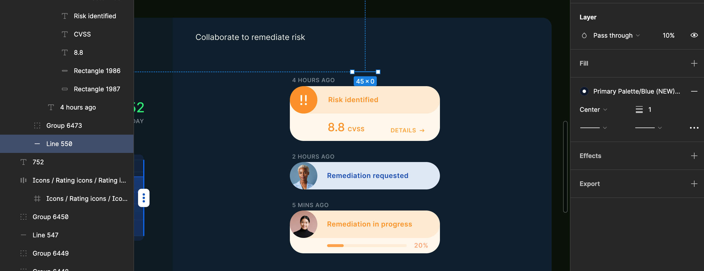
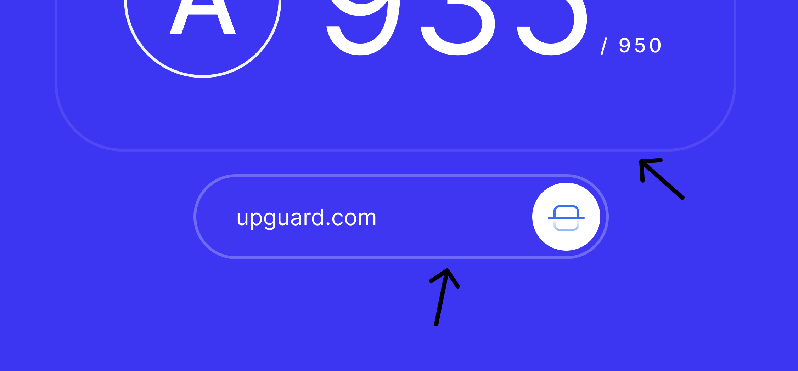

# Webflow challenge

Published website:

```
https://angie-hentri.webflow.io
```


# Design interpretation & decision making

As much as I want to ensure design accuracy in the implementation (as pixel-perfect), some parts of the design could be clarified, and I will expand more on this below. For this challenge, I will treat the design as flat (e.g., ignoring layer transparency/opacity used for colour manipulation) and follow best practices for user experience.

## Clarifications to ask & design changes

In an actual scenario, upon receiving the design, I would like to have the opportunity to discuss it with the designer. This would allow me to ask for clarification and provide input or comment on the design decisions before implementing them.

- I've set up variables for style management that are reusable and maintainable. The decision on the naming should be discussed with the designer so that it's in sync with the design system as the source of truth. In this instance, I will name them according to standard practices.
  - If there is a proper design system, I would also ensure that the variables are set up as detailed as the design system; for example, the letter spacing, line height, and font sizes are to be set as per the system. In this instance, the variables I've created are based on the actual design.
  - In this implementation, I will convert a small variant into the closest used for consistency, e.g., there are 150% and 160% variants used in some of the line-height in the typography. I will use only one of them (160% as it's used in different font sizes).
  
- Font weight variations. The design uses four different font-weight variations. Based on their occurrence throughout the design, I will discuss with the designer the possibility of limiting the font weight to no more than three (regular 400, medium 500, and bold 700). A semi-bold (600) is used twice in the banner and in the case-study section image caption in a small font-size. I would recommend replacing it with medium or bold instead of adding a new variant to avoid overloading the site with Google fonts.

- Image assets, e.g., the case study. Is it supposed to be changeable depending on themes, occasions, blog categories, etc.?
  - The Figma design of the image consists of layers of colours stacked on top of each other to create the image's colour. Do we want to use a grayscale image asset and change the colour accordingly? For this implementation, I treat the case study section as is, without the customisation to change the image's colour and quote decorative lines.
  
- Some elements in the design are not immediately visible and could use some clarification. These hidden elements could be crucial for the overall design, and I believe understanding them better will help in the implementation process.
  - For example, there is a line above the UI screenshot that could be clarified if that's an intended line to be displayed in the design:
  
    
  
- In the "Security Ratings" section, I would like to clarify the representation of the icon next to the `upguard.com` input text field, as it is quite unclear. Is it to represent a scanner, a keyboard key (to indicate a push), a half-check box or something else? I would recommend replacing it with an alternative icon or using explicit wording such as "check score", "score", or "?" for a better user experience.
  
  - For this reason, I've changed the design to be more explicit and added a label above the text field so that it will improve the user experience.
  
  - I would also address the inconsistency in the border colour of the life score/result and the text field, as the opacity is different (40% and 100% on the layer opacity, respectively). At this stage, I have decided to make the border colour and opacity the same to ensure consistency.
  
    
  
  - It could also be an opportunity to add animated soft pulsing to the score result box to emphasise the interaction.

## Trade-offs

- Due to the time limitation and using Webflow for the first time after so many years, I didn't manage to finish all the stretch goals.
- The Navigation open menu is not great; somehow, the interaction is not as expected (how the animation doesn't appear as intended).
- If there is more time, I would love to create the score instant score-checking form with Javascript without using the Webflow native form. I tried to attempt to get rid of the success message, but it didn't work! The error message also didn't trigger on the document as intended.
- If there is more time, I would clean up the CSS files and variables and perhaps add more custom CSS, as they are quite messy, although some are reusable, by using the combo CSS.
- I would also love to add more page interactions, such as a loading page or sliding content as you scroll, and animations to make the website more exciting.
- Please note that the responsiveness is not as fluid as I want it to be. Especially the hero heading. I could have broken it into spans so the switch graphic could stay relative to the first line instead of the wrapper.

## Reflections

Thank you, I enjoyed the challenge! It took quite a learning curve to develop with Webflow if you're used to building a website from scratch with React or other frameworks. I look forward to learning more!


---

<sub>**Crafted with care ❤ (within a very limited time) by a-sh. in 2024**</sub>

